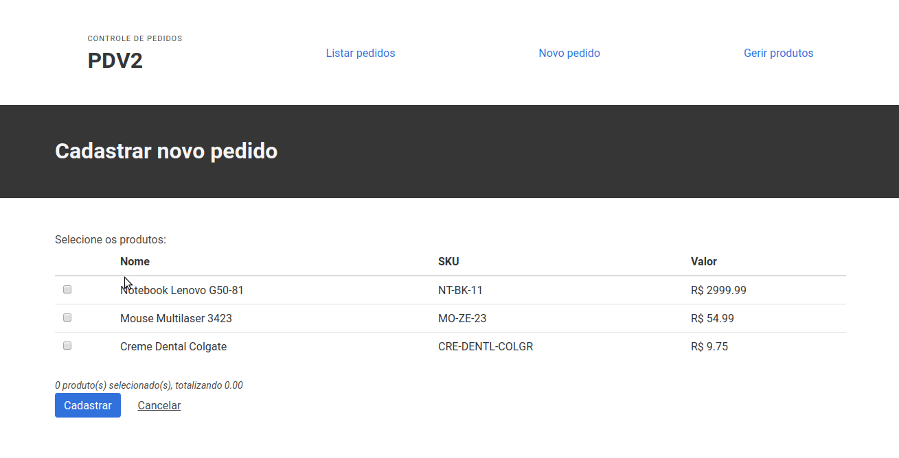

# PDV2

PDV2 é um projeto de controle de pedidos desenvolvido como desafio para o processo seletivo do Grupo Polvo

> **Proposta**
> Desenvolvimento de um CRUD de cadastro de produtos em PHP e MySQL

## Desenvolvimento

### Back-end (diretório api)

O PDV2 provê uma API RESTful em Laravel 5.6 com integração com o MySQL. Basta setar as credenciais de acesso ao banco no arquivo de ambiente `api/.env`

| Método | URL              | Recurso                 |
| ------ | ---------------- | ----------------------- |
| GET    | api/products/    | Lista todos os produtos |
| GET    | api/products/:id | Exibe produto pelo ID   |
| POST   | api/products/    | Cadastra um produto     |
| PUT    | api/products/:id | Edita um produto        |
| DELETE | api/products/:id | Remove um produto       |
| GET    | api/orders/      | Lista todos os pedidos  |
| GET    | api/orders/:id   | Exibe pedido pelo ID    |
| POST   | api/orders/      | Cadastra um pedido      |

Estrutura básica do Produto

    {
        "id": 1,
        "sku": "NT-BK-11",
        "name": "Notebook Lenovo G50-81",
        "description": "Notebook i7, 1TB HD, Placa AMD dedicada com sistema Dolby Digital",
        "price": 2999.99
    }

Estrutura básica do Pedido

    [
        {
            "id": 2,
            "date": "2018-07-24",
            "total": 3054.98,
            "products": [
                {
                    "id": 1,
                    "sku": "NT-BK-11",
                    "name": "Notebook Lenovo G50-81",
                    "description": "Notebook i7, 1TB HD, Placa AMD dedicada com sistema Dolby Digital",
                    "price": 2999.99
                },
                {
                    "id": 3,
                    "sku": "MO-ZE-23",
                    "name": "Mouse Multilaser 3423",
                    "description": "Mouse sem fio com rolagem suave e atalhos de navegação",
                    "price": 54.99
                }
            ]
        }
    ]

Exemplo de request para cadastro de pedido

    {
        "date": "2018-07-24",
        "total": 54.99,
        "products": [1]
    }

### Front-end (diretório app)

O sistema utiliza o React + Redux como framework front-end e [Bulma.io](https://bulma.io) como framework CSS. O app consome a API construída.

Inicialmente, o aplicativo procura pela API no endereço local `http://localhost:8000`. Caso seja necessário iniciar o servidor em outro endereço ou caso esteja em produção, basta alterar o arquivo `app/config/app.js`

## Como instalar localmente

Primeiro, clone o repositório e acesse a pasta raíz do projeto.

Depois, acesse a API, edite o arquivo .env com suas credenciais e instale as migrações do banco de dados:

    php artisan migrate

Inicie o servidor built-in através do comando:

    php -S localhost -t public/

Depois, acesse o diretório do aplicativo (app/) e inicie o servidor do React.js

    npm start

Está lá :)
